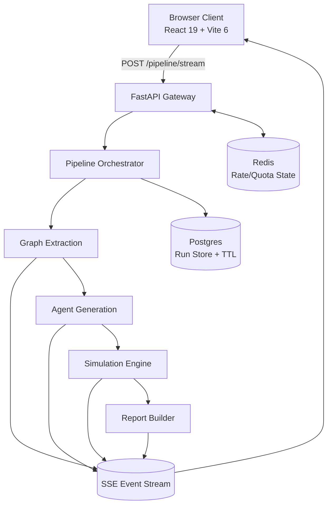
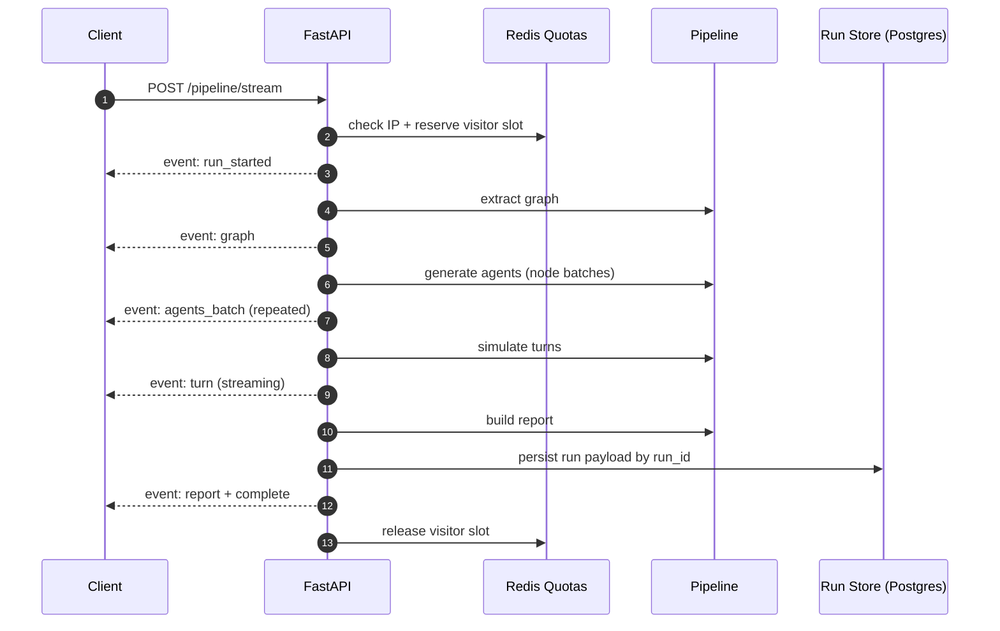

# SynSoc AI - Simulates Society Before It Reacts

[](https://synsoc-ai.netlify.app)
[](https://synsoc-api-production.up.railway.app/health)
[](https://www.python.org/)
[](https://fastapi.tiangolo.com/)
[](https://react.dev/)
[](https://vitejs.dev/)
[](https://openai.com/)
[](#license)

> **Multi-agent social simulation engine.** Enter any policy or social topic and SynSoc AI generates a stakeholder graph, spawns 30+ ideology-diverse agents, streams live debate rounds, and returns decision-ready reports with conflict pressure, coalition signals, and action paths.

**Live app ->** [https://synsoc-ai.netlify.app ](https://synscoai.pages.dev/) 
**API docs ->** https://synsoc-api-production.up.railway.app/docs

---

## What is SynSoc AI?

Most policy analysis tools answer once and stop. Real societies do not.

SynSoc AI models **interaction, disagreement, and adaptation**. It simulates how stakeholders respond to each other over multiple rounds, then converts those dynamics into structured insights for policy and strategy teams.

Instead of one model role-playing everyone, SynSoc AI orchestrates a **networked society of agents** with distinct goals, incentives, influence levels, and stance trajectories.

---

## Core Experience

```
1. Enter a social or policy topic
        ↓
2. Generate stakeholder graph + 30+ agents
        ↓
3. Stream multi-round debate in real time (SSE)
        ↓
4. Review conflict analytics, coalition map, transcript, and recommendations
        ↓
5. Persist run + export report as PDF/DOCX
```

---

## Architecture

```
┌──────────────────────────────────────────────────────────────────────────┐
│                         User Browser · Netlify                           │
│                    React 19 + Vite 6 + SSE client                        │
└──────────────────────────────┬───────────────────────────────────────────┘
                               │ POST /pipeline/stream
                               ▼
┌──────────────────────────────────────────────────────────────────────────┐
│                         FastAPI Backend · Railway                        │
│                                                                          │
│  ┌───────────────────────── API Guard Rail Layer ─────────────────────┐  │
│  │ CORS allowlist · Input validation · Timeout · Trusted proxy parser │  │
│  │ IP rate limit (60/min) · Visitor quotas (25/day, 1 concurrent)     │  │
│  └───────────────────────────────────┬──────────────────────────────────┘  │
│                                      │                                     │
│  ┌────────────────────────────── Pipeline Engine ───────────────────────┐  │
│  │ Graph Extraction -> Agent Generation -> Simulation -> Report Build   │  │
│  │ Node-batch concurrency + turn-level live stream + keepalive frames   │  │
│  └───────────────────────────────────┬──────────────────────────────────┘  │
│                                      │                                     │
│  ┌────────────────────────────── Streaming Event Bus ───────────────────┐  │
│  │ run_started · graph · agents_batch · turn · simulation_complete      │  │
│  │ report · complete · error                                             │  │
│  └───────────────────────────────────┬──────────────────────────────────┘  │
│                                      │                                     │
│  ┌────────────── Persistence + Limits Backplane ───────────────────────┐  │
│  │ Postgres (durable run payload + TTL) · Redis (rate/quota state)     │  │
│  └──────────────────────────────────────────────────────────────────────┘  │
└──────────────────────────────────────────────────────────────────────────┘
```





---

## New Skills Added

| New capability | What it unlocks |
|---|---|
| **Durable run memory** | Persist full simulation payloads by `run_id` with TTL-backed retrieval via `/runs/{run_id}` |
| **One-click report exports** | Download complete run reports as **PDF** and **DOCX** |
| **Streaming resilience** | SSE keepalive frames reduce dropped long-running streams behind proxies/CDNs |
| **Node-batch agent generation** | Parallel per-node agent creation in stream mode for faster visible progress |
| **Proxy-aware identity hardening** | `x-forwarded-for` / `x-real-ip` trusted only from configured proxy CIDRs |
| **Distributed quota state** | Redis-backed IP limit + visitor slot state for multi-instance consistency |
| **Production persistence guardrail** | Optional strict mode requiring URL-backed stores in production-like environments |
| **Results recovery UX** | Frontend rehydrates results by `run` query param and enables export from results page |

---

## Feature Highlights

| Feature | Details |
|---|---|
| **Live simulation timeline** | Event-driven SSE stream from first byte to final report |
| **Stakeholder knowledge graph** | Entity extraction with links, tensions, and policy axes |
| **Agent network visualisation** | 30+ agents mapped by stance, node origin, and influence |
| **Conflict scoring** | Backend conflict index plus stance distribution and tension extraction |
| **Coalition intelligence** | Pro/Neutral/Con groupings with recommendation stratification |
| **Run persistence + recovery** | Resume result pages from `run_id` even after stream disconnects |
| **Export pipeline** | Shareable policy artifacts via `/export/pdf` and `/export/docx` |
| **Consent-aware analytics** | Opt-in cookie analytics bootstrapping on frontend |
| **Security by default** | CORS allowlist, strict input bounds, proxy trust controls, rate limits |

---

## Tech Stack

### Frontend
| Tool | Version | Role |
|---|---|---|
| React | 19 | UI framework |
| Vite | 6.4.x | Build tool + dev server |
| TypeScript | 5.7.x | Static typing |
| React Router | 7.12.x | Route orchestration |
| TanStack Query | 5.62.x | Async data orchestration |
| D3.js | 7.9.x | Agent/network graph visualisation |
| Three.js | 0.183.x | Animated visual background |
| Motion | 12.29.x | UI animation system |
| Radix UI | 1.x/2.x | Accessible primitives |
| Netlify / Cloudflare Pages | - | Frontend deployment + edge proxy |

### Backend
| Tool | Version | Role |
|---|---|---|
| Python | 3.11+ | Runtime |
| FastAPI | 0.135.3 | API framework |
| Uvicorn | 0.44.0 | ASGI server |
| OpenAI SDK | 2.31.0 | LLM orchestration |
| asyncpg | 0.31.0 | Postgres run persistence |
| Redis | 5.2.1 | Distributed rate/quota state |
| PyJWT | 2.10.1 | Optional JWT verification helper |
| reportlab + python-docx | 4.4.1 + 1.1.2 | PDF/DOCX generation |
| Railway | - | Live backend deployment |
| Render | - | Optional alternative via `render.yaml` |

### Design Patterns
- **Streaming-first architecture** - SSE events are primary UX transport, not an afterthought.
- **Four-stage pipeline** - graph, agents, simulation, report as discrete and testable units.
- **Defense in depth** - request guards, quotas, timeout protection, and trusted proxy checks.
- **State separation** - Redis for short-lived quota state; Postgres for durable run artifacts.
- **Recoverable UX** - every streamed pipeline emits `run_id` for fetch/export recovery paths.

---

## API Surface

| Endpoint | Method | Purpose |
|---|---|---|
| `/health` | GET | Health check |
| `/analyze` | POST | Topic -> stakeholder graph extraction |
| `/agents` | POST | Agent generation from graph |
| `/simulate` | POST | Batch simulation run |
| `/report` | POST | Report generation |
| `/pipeline` | POST | End-to-end non-stream run |
| `/pipeline/stream` | POST | **End-to-end streaming run (primary)** |
| `/runs/{run_id}` | GET | Fetch persisted run payload |
| `/runs/{run_id}/export/pdf` | GET | Export persisted run report as PDF |
| `/runs/{run_id}/export/docx` | GET | Export persisted run report as DOCX |

Full interactive docs: https://synsoc-api-production.up.railway.app/docs

---

## Performance

Reference production timing run for full simulation flow (varies by topic/model):

| Milestone | Time |
|---|---|
| Submit -> LIVE | 825 ms |
| Stream TTFB | 1,258 ms |
| Stream total | 42,858 ms |
| Submit -> COMPLETE | 43,412 ms |
| Submit -> results render | 44,261 ms |

---

## Quickstart

### Prerequisites

- Python 3.11+
- Node.js 22+
- npm
- OpenAI API key

### 1 - Backend

```bash
cd /path/to/SynScoAI
python -m venv .venv
source .venv/bin/activate          # Windows: .venv\Scripts\activate
python -m pip install --upgrade pip
pip install -r requirements.txt
cp .env.example .env               # then fill in your keys
```

```bash
uvicorn app.main:app --host 0.0.0.0 --port 8000 --reload
```

### 2 - Frontend

```bash
cd synsoc-ai-frontend
npm install
cp env.example .env
```

Set API URL in `synsoc-ai-frontend/.env`:

```env
VITE_API_BASE_URL=http://localhost:8000
```

For Netlify or Cloudflare Pages production builds, use same-origin proxy path:

```env
VITE_API_BASE_URL=/backend
```

```bash
npm run dev
```

Open http://localhost:5173

---

## Environment Variables

### Backend (`.env`)

| Variable | Required | Example | Notes |
|---|---|---|---|
| `OPENAI_API_KEY` | yes | `sk-...` | OpenAI secret key |
| `OPENAI_MODEL` | yes | `gpt-5.4-mini` | Default model fallback |
| `OPENAI_MODEL_GRAPH` | no | `gpt-5.4-mini` | Graph extraction model override |
| `OPENAI_MODEL_AGENTS` | no | `gpt-5.4-mini` | Agent generation model override |
| `OPENAI_MODEL_SIMULATION` | no | `gpt-5.4-nano` | High-volume turn generation model |
| `OPENAI_MODEL_REPORT` | no | `gpt-5.4-mini` | Report model override |
| `ALLOWED_ORIGINS` | yes | `http://localhost:5173,...` | Comma-separated CORS origins; wildcard not allowed |
| `RATE_LIMIT_PER_MINUTE_IP` | yes | `60` | Max requests per IP per minute |
| `SIM_LIMIT_PER_DAY_VISITOR` | yes | `25` | Max simulations per visitor per day |
| `MAX_CONCURRENT_SIM_PER_VISITOR` | yes | `1` | Max simultaneous sims per visitor |
| `REQUEST_TIMEOUT_SECONDS` | yes | `300` | Full simulation request timeout |
| `MAX_INPUT_CHARS_TOPIC` | yes | `240` | Topic max characters |
| `MAX_INPUT_CHARS_CONTEXT` | yes | `4000` | Context max characters |
| `PIPELINE_STREAM_NODE_CONCURRENCY` | no | `4` | Node batch parallelism in stream mode |
| `RUN_RESULT_TTL_SECONDS` | no | `86400` | Persisted run retention TTL (min 60) |
| `DATABASE_URL` | yes (prod) | `postgresql://...` | Postgres run store |
| `REDIS_URL` | yes (prod) | `redis://...` | Redis quota/rate state |
| `REQUIRE_PERSISTENT_URLS` | no | `true` | Enforce URL-backed stores (`DATABASE_URL` + `REDIS_URL`) |
| `RAILWAY_ENVIRONMENT` | no | `production` | If set to production, strict persistence defaults to true |
| `TRUST_PROXY_HEADERS` | no | `false` | Enable trusted proxy forwarding parsing |
| `TRUSTED_PROXY_IPS` | no | `10.0.0.0/8,192.168.0.0/16` | Allowed proxy CIDRs/IPs for forwarded headers |
| `SUPABASE_JWT_SECRET` | no | `your-jwt-secret` | Optional local JWT verification |
| `SUPABASE_JWT_AUDIENCE` | no | `authenticated` | Optional token audience check |
| `SUPABASE_JWT_ISSUER` | no | `https://<project-ref>.supabase.co/auth/v1` | Optional issuer validation / introspection base |
| `SUPABASE_SERVICE_ROLE_KEY` | no | `eyJ...` | Optional fallback for token introspection |

### Frontend (`synsoc-ai-frontend/.env`)

| Variable | Required | Example | Notes |
|---|---|---|---|
| `VITE_API_BASE_URL` | recommended | `http://localhost:8000` | Local dev URL; use `/backend` in production |
| `VITE_API_URL` | no | `http://localhost:8000` | Alias fallback when `VITE_API_BASE_URL` is unset |
| `VITE_PUBLIC_URL` | no | `http://localhost:5173` | Public origin used by frontend integrations |

---

## Deployment

### Frontend - Netlify

[synsoc-ai-frontend/netlify.toml](synsoc-ai-frontend/netlify.toml):

```toml
[build]
  command = "npm run build"
  publish = "dist/client"

[build.environment]
  NODE_VERSION = "22"
  VITE_API_BASE_URL = "/backend"

[[redirects]]
  from = "/backend/*"
  to = "https://synsoc-api-production.up.railway.app/:splat"
  status = 200
  force = true

[[redirects]]
  from = "/api/*"
  to = "https://synsoc-api-production.up.railway.app/:splat"
  status = 200
  force = true
```

### Frontend - Cloudflare Pages

Project settings:

- **Repository:** `VaibhavGIT5048/SynScoAI`
- **Branch:** `main`
- **Root directory:** `synsoc-ai-frontend`
- **Build command:** `npm run build`
- **Build output directory:** `dist/client`

Keep frontend API calls same-origin via `VITE_API_BASE_URL=/backend` and use committed Pages Function proxy:

- [synsoc-ai-frontend/functions/backend/[[path]].ts](synsoc-ai-frontend/functions/backend/[[path]].ts)

Set Cloudflare Pages environment variable:

- `BACKEND_ORIGIN=https://synsoc-api-production.up.railway.app`

### Backend - Railway (live)

**Build command:**
```bash
python -m pip install --upgrade pip && pip install -r requirements.txt
```

**Start command:**
```bash
uvicorn app.main:app --host 0.0.0.0 --port $PORT
```

Set all environment variables in Railway project dashboard under **Variables**.

### Backend - Render (optional)

Ready manifest is included at [render.yaml](render.yaml) with matching build/start commands and `healthCheckPath: /health`.

---

## Project Layout

```
SynScoAI/
├── app/                          # FastAPI application
│   ├── main.py                   # App entry point, middleware, CORS
│   ├── config.py                 # Env parsing and runtime settings
│   ├── security.py               # Rate limits, visitor quotas, timeout guards
│   ├── routers/                  # Route handlers per endpoint group
│   │   ├── analyze.py
│   │   ├── agents.py
│   │   ├── simulate.py
│   │   ├── report.py
│   │   ├── pipeline.py
│   │   └── runs.py
│   ├── models/
│   │   └── graph.py              # Request/response schemas
│   └── services/                 # Pipeline and infrastructure services
│       ├── graph_service.py
│       ├── agent_service.py
│       ├── simulation_service.py
│       ├── report_service.py
│       ├── run_store.py          # Postgres/in-memory run persistence
│       ├── export_service.py     # PDF/DOCX builders
│       ├── llm_client.py
│       └── auth_service.py       # Optional Supabase token resolution
├── requirements.txt
├── .env.example
├── render.yaml
├── docs/
│   ├── demo-script-2min.md
│   └── dependency-upgrade-plan.md
├── tests/                        # Backend test suite
└── synsoc-ai-frontend/           # React + Vite frontend
    ├── src/
    │   ├── components/
    │   ├── layouts/
    │   ├── pages/
    │   ├── lib/
    │   └── styles/
    ├── functions/backend/[[path]].ts   # Edge proxy for same-origin API
    ├── netlify.toml
    └── vite.config.ts
```

---

## Troubleshooting

<details>
<summary>CORS error from frontend</summary>

Set backend `ALLOWED_ORIGINS` to include your frontend origin, then redeploy backend:

```
ALLOWED_ORIGINS=http://localhost:5173,https://synsoc-ai.netlify.app
```

For Cloudflare Pages, include Pages domains too:

```
ALLOWED_ORIGINS=http://localhost:5173,https://synsoc-ai.netlify.app,https://<project>.pages.dev,https://<your-custom-domain>
```
</details>

<details>
<summary>Railway build fails on Python 3.13</summary>

Add this Railway variable to pin the runtime:

```
RAILPACK_PYTHON_VERSION=3.12
```
</details>

<details>
<summary>Netlify shows 404 at root</summary>

Ensure `publish` is set to `dist/client` in `synsoc-ai-frontend/netlify.toml`, not `dist`.
</details>

<details>
<summary>Simulation takes too long / times out</summary>

Increase `REQUEST_TIMEOUT_SECONDS` in your backend `.env`. Full simulations with 30+ agents typically run 40–50 seconds end-to-end.
</details>

<details>
<summary>Rate limit hit immediately</summary>

`RATE_LIMIT_PER_MINUTE_IP` counts all requests per IP, not just simulations. During development against localhost, lower this limit to avoid interfering with hot-reload requests.
</details>

<details>
<summary>Incorrect client IP detected behind a proxy</summary>

Enable proxy trust only when your ingress IPs are known:

```
TRUST_PROXY_HEADERS=true
TRUSTED_PROXY_IPS=<comma-separated-proxy-cidrs-or-ips>
```
</details>

<details>
<summary>Stream drops before report completes</summary>

Use persisted run recovery: read the emitted `run_id`, then fetch:

```
GET /runs/{run_id}
GET /runs/{run_id}/export/pdf
GET /runs/{run_id}/export/docx
```

Also confirm your proxy/CDN does not buffer or cut long-lived event streams.
</details>

<details>
<summary>Run not found or expired</summary>

Runs are TTL-bound by `RUN_RESULT_TTL_SECONDS`.

Increase TTL when you need longer-lived result retrieval:

```
RUN_RESULT_TTL_SECONDS=172800
```
</details>

---

## Demo Script

A 2-minute presentation-ready walkthrough is in [docs/demo-script-2min.md](docs/demo-script-2min.md).

---

## Use Cases

- **Governments & policy teams** — model how a regulation will be received across stakeholder groups before announcement
- **Researchers** — generate diverse synthetic perspectives for qualitative study
- **Journalists** — map stakeholder conflict landscape for a story quickly
- **Educators** — run live classroom simulations on social and policy dilemmas
- **Strategy consultants** — stress-test proposals against simulated opposition

---

## License

This project is licensed under the **MIT License** — see the [LICENSE](LICENSE) file for details.

---

*Built with FastAPI, React, and OpenAI. Deployed on Railway + Netlify, with Cloudflare Pages support and optional Render deployment via `render.yaml`.*
