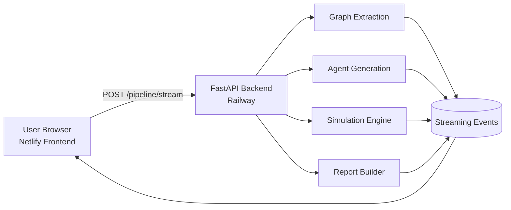

# SynSoc AI

[](https://synsoc-ai.netlify.app)
[](https://synsoc-api-production.up.railway.app/health)
[](https://www.python.org/)
[](https://fastapi.tiangolo.com/)
[](https://react.dev/)
[](https://vitejs.dev/)
[](https://openai.com/)
[](#license)

> **Multi-agent social simulation engine.** Enter any policy or social topic — SynSoc AI spawns 30+ AI agents with diverse expertise, biases, and goals; runs live debates; extracts knowledge graphs; and generates dynamic reports with conflict scores, predicted outcomes, and actionable recommendations.

**Live app →** https://synsoc-ai.netlify.app  
**API docs →** https://synsoc-api-production.up.railway.app/docs

---

## What is SynSoc AI?

Policy and strategy teams routinely miss second-order effects in stakeholder conflict. SynSoc AI transforms static policy analysis into an **interactive, data-driven simulation** — letting governments, researchers, journalists, and educators stress-test scenarios before real-world decisions are made.

Instead of a single model answering a question, SynSoc AI **orchestrates a society of agents** — each with distinct roles, incentives, and ideological leanings — then synthesises their conflict and consensus into decision-ready intelligence.

---

## Core Experience

```
1. Enter a social or policy topic
        ↓
2. Generate knowledge graph + 30+ agents
        ↓
3. Stream multi-agent debate rounds in real time
        ↓
4. Review analytics, conflict scores, transcripts, and recommendations
```

---

## Architecture

```
┌─────────────────────────────────────────────────────────┐
│                   User Browser · Netlify                │
│              React 19 + Vite 6 · SSE client             │
└───────────────────────┬─────────────────────────────────┘
                        │  POST /pipeline/stream
                        ▼
┌─────────────────────────────────────────────────────────┐
│              FastAPI Backend · Railway                  │
│                                                         │
│  ┌─────────────┐  Rate limit · CORS · Input validation  │
│  │ API Gateway │  60 req/min · 25 sim/day · 1 concurrent│
│  └──────┬──────┘                                        │
│         │                                               │
│  ┌──────▼──────────────────────────────────────────┐    │
│  │                 Pipeline                        │    │
│  │  ┌──────────┐  ┌──────────┐  ┌──────────┐  ┌───┴──┐ │
│  │  │  Graph   │→ │  Agent   │→ │  Sim     │→ │Report│ │
│  │  │Extraction│  │Generation│  │ Engine   │  │Build │ │
│  │  └──────────┘  └──────────┘  └──────────┘  └──────┘ │
│  └──────────────────────┬────────────────────────────┘  │
│                         │                               │
│  ┌──────────────────────▼────────────────────────────┐  │
│  │        Streaming Event Bus (SSE)                  │  │
│  │   TTFB ~1.26s  ·  Full stream ~43s  ·  Live ticks │  │
│  └───────────────────────────────────────────────────┘  │
└─────────────────────────────────────────────────────────┘
                        │
                        ▼ Streaming response back to browser
```



---

## Feature Highlights

| Feature | Details |
|---|---|
| **Live simulation timeline** | Streaming status updates via SSE as each agent takes turns |
| **Stakeholder knowledge graph** | Extracted entities, relationships, and tension axes |
| **Agent network visualisation** | 30+ agents rendered with stance distribution |
| **Conflict scoring** | Per-agent and aggregate conflict/consensus metrics |
| **Report tab** | Recommendation buckets, coalition map, outcome predictions |
| **Consent-aware analytics** | Cookie banner with opt-in initialisation |
| **Production hardening** | CORS lockdown, per-IP rate limiting, per-visitor sim quotas |

---

## Tech Stack

### Frontend
| Tool | Version | Role |
|---|---|---|
| React | 19 | UI framework |
| Vite | 6 | Build tool + dev server |
| Netlify | — | CDN deployment + SPA routing |
| Recharts | — | Analytics charts |
| Mermaid.js | — | Knowledge graph visualisation |

### Backend
| Tool | Version | Role |
|---|---|---|
| Python | 3.11+ | Runtime |
| FastAPI | 0.111 | API framework |
| Uvicorn | — | ASGI server |
| OpenAI SDK | — | LLM calls (GPT-*) |
| Railway | — | Cloud deployment |

### Design Patterns
- **Streaming-first** — SSE from first byte; UI updates are event-driven, not polled
- **Pipeline architecture** — four discrete, testable stages with individual endpoints
- **Rate limiting** — IP-level (60/min) + visitor-level (25 sim/day, 1 concurrent)
- **CORS hardening** — strict `ALLOWED_ORIGINS` enforced at middleware level

---

## API Surface

| Endpoint | Method | Purpose |
|---|---|---|
| `/health` | GET | Health check |
| `/analyze` | POST | Topic → stakeholder graph extraction |
| `/agents` | POST | Agent generation from graph |
| `/simulate` | POST | Batch simulation run |
| `/simulate/stream` | POST | Streaming simulation |
| `/report` | POST | Report generation |
| `/pipeline` | POST | End-to-end single-request run |
| `/pipeline/stream` | POST | **End-to-end streaming (primary endpoint)** |

Full interactive docs: https://synsoc-api-production.up.railway.app/docs

---

## Performance

Latest live Netlify timing run (full simulation flow):

| Milestone | Time |
|---|---|
| Submit → LIVE | 825 ms |
| Stream TTFB | 1,258 ms |
| Stream total | 42,858 ms |
| Submit → COMPLETE | 43,412 ms |
| Submit → results render | 44,261 ms |

---

## Quickstart

### Prerequisites

- Python 3.11+
- Node.js 22+
- npm
- OpenAI API key

### 1 — Backend

```bash
cd /path/to/SynScoAI
python -m venv .venv
source .venv/bin/activate          # Windows: .venv\Scripts\activate
python -m pip install --upgrade pip
pip install -r requirements.txt
cp .env.example .env               # then fill in your keys
```

```bash
uvicorn app.main:app --host 0.0.0.0 --port 8000 --reload
```

### 2 — Frontend

```bash
cd synsoc-ai-frontend
npm install
cp env.example .env
```

Set the API URL in `synsoc-ai-frontend/.env`:

```env
VITE_API_BASE_URL=http://localhost:8000
```

```bash
npm run dev
```

Open http://localhost:5173

---

## Environment Variables

### Backend (`.env`)

| Variable | Required | Example | Notes |
|---|---|---|---|
| `OPENAI_API_KEY` | ✅ | `sk-...` | Your OpenAI secret key |
| `OPENAI_MODEL` | ✅ | `gpt-4o-mini` | Model string |
| `ALLOWED_ORIGINS` | ✅ | `http://localhost:5173,...` | Comma-separated CORS origins |
| `RATE_LIMIT_PER_MINUTE_IP` | ✅ | `60` | Max requests per IP per minute |
| `SIM_LIMIT_PER_DAY_VISITOR` | ✅ | `25` | Max simulations per visitor per day |
| `MAX_CONCURRENT_SIM_PER_VISITOR` | ✅ | `1` | Max simultaneous sims per visitor |
| `REQUEST_TIMEOUT_SECONDS` | ✅ | `120` | Upstream timeout |
| `MAX_INPUT_CHARS_TOPIC` | ✅ | `240` | Topic field character limit |
| `MAX_INPUT_CHARS_CONTEXT` | ✅ | `4000` | Context field character limit |

### Frontend (`synsoc-ai-frontend/.env`)

| Variable | Required | Example |
|---|---|---|
| `VITE_API_BASE_URL` | ✅ | `http://localhost:8000` |

---

## Deployment

### Frontend — Netlify

`synsoc-ai-frontend/netlify.toml`:

```toml
[build]
  command = "npm run build"
  publish = "dist/client"

[build.environment]
  NODE_VERSION = "22"
```

### Backend — Railway

**Build command:**
```bash
python -m pip install --upgrade pip && pip install -r requirements.txt
```

**Start command:**
```bash
uvicorn app.main:app --host 0.0.0.0 --port $PORT
```

Set all environment variables in the Railway project dashboard under **Variables**.

---

## Project Layout

```
SynScoAI/
├── app/                          # FastAPI application
│   ├── main.py                   # App entry point, middleware, CORS
│   ├── routers/                  # Route handlers per endpoint group
│   └── services/                 # Pipeline stage implementations
│       ├── graph_extraction.py
│       ├── agent_generation.py
│       ├── simulation_engine.py
│       └── report_builder.py
├── requirements.txt
├── .env.example
├── docs/
│   └── demo-script-2min.md       # Presentation-ready demo script
└── synsoc-ai-frontend/           # React + Vite frontend
    ├── src/
    │   ├── components/
    │   ├── hooks/
    │   └── pages/
    ├── netlify.toml
    └── vite.config.js
```

---

## Troubleshooting

<details>
<summary>CORS error from the frontend</summary>

Set backend `ALLOWED_ORIGINS` to include your frontend origin and redeploy the backend.

```
ALLOWED_ORIGINS=http://localhost:5173,https://synsoc-ai.netlify.app
```
</details>

<details>
<summary>Railway build fails on Python 3.13</summary>

Add this Railway variable to pin the runtime:

```
RAILPACK_PYTHON_VERSION=3.12
```
</details>

<details>
<summary>Netlify shows 404 at root</summary>

Ensure `publish` is set to `dist/client` in `synsoc-ai-frontend/netlify.toml`, not `dist`.
</details>

<details>
<summary>Simulation takes too long / times out</summary>

Increase `REQUEST_TIMEOUT_SECONDS` in your backend `.env`. Full simulations with 30+ agents typically run 40–50 seconds end-to-end.
</details>

<details>
<summary>Rate limit hit immediately</summary>

`RATE_LIMIT_PER_MINUTE_IP` counts all requests per IP, not just simulations. During development against localhost, lower this limit to avoid interfering with hot-reload requests.
</details>

---

## Demo Script

A 2-minute presentation-ready walkthrough is in [`docs/demo-script-2min.md`](docs/demo-script-2min.md).

---

## Use Cases

- **Governments & policy teams** — model how a regulation will be received across stakeholder groups before announcement
- **Researchers** — generate diverse synthetic perspectives for qualitative study
- **Journalists** — map stakeholder conflict landscape for a story quickly
- **Educators** — run live classroom simulations on social and policy dilemmas
- **Strategy consultants** — stress-test proposals against simulated opposition

---

## License

For academic and demo use. Add your preferred open-source license if you plan public redistribution.

---

*Built with FastAPI, React, and OpenAI. Deployed on Railway + Netlify.*
